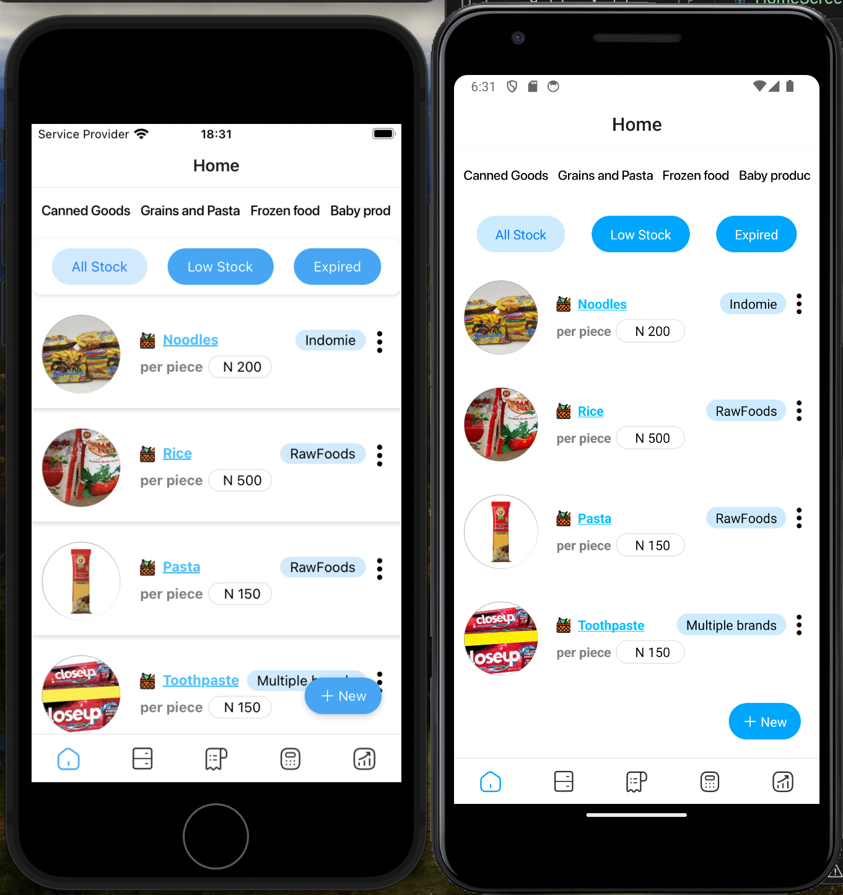
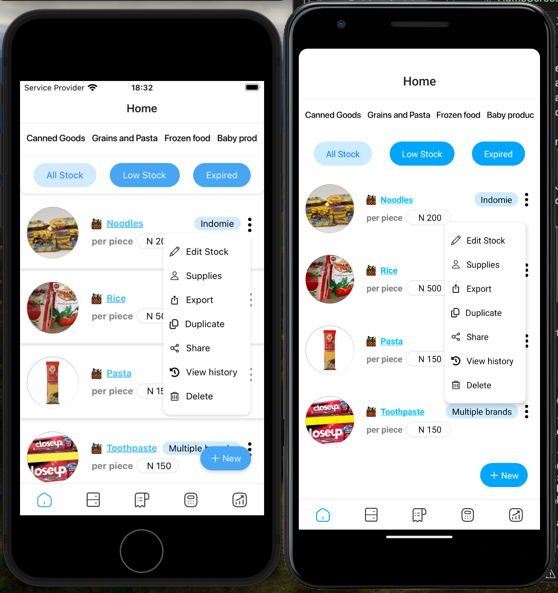

## Test assessment for SpinGo
    expo init SpinGoTest
    cd SpinGoTest
    npm install
    npm start

- Install the required packages for React Navigation.
Set Up Navigation:
    npm install @react-navigation/native @react-navigation/stack
    npm install react-native-screens react-native-safe-area-context

- This will allow you to create a carousel of images and an indicator below to show the active image. 
    npm install react-native-snap-carousel
    npm install --save react-native-linear-gradient

- react-native-snap-carousel library for the sliding images 

- touch declarations.d.ts, then add the declarations
npm install --save-dev @types/react-native-snap-carousel

For fonts, so you can use for the entire application
- expo install expo-font

- To set up bottom tab navigation with a Home, etc.
- Install React Navigation Tabs:
    npm install @react-navigation/bottom-tabs

- For icons
npm install @expo/vector-icons

## Screenshot

